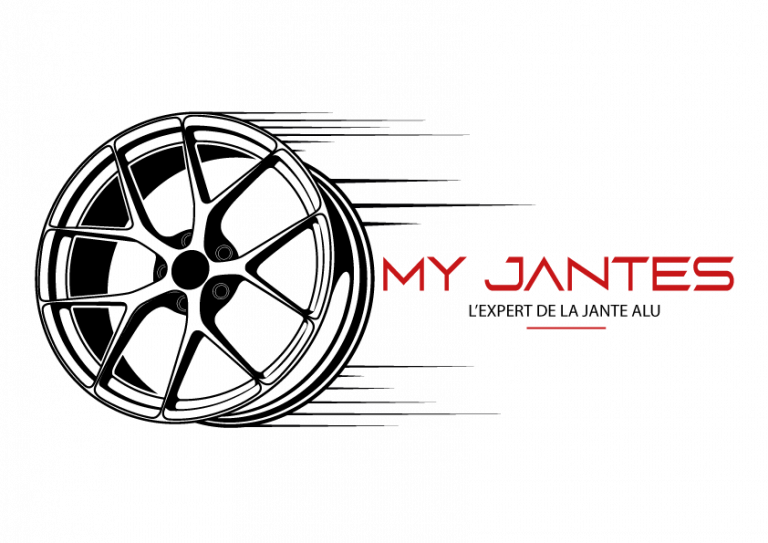

# MyJantes - Application Mobile de Services Automobiles

<div align="center">
  
  
  
  
  
  
</div>

## 📱 Description

MyJantes est une application mobile Flutter dédiée à la gestion complète de services automobiles, spécialisée dans les jantes et pneus. L'application offre une solution complète pour les clients et les administrateurs avec un design sombre moderne et une interface utilisateur intuitive inspirée d'iOS.

## ✨ Fonctionnalités Principales

### 👤 Espace Client
- **Authentification sécurisée** avec JWT et gestion de sessions
- **Catalogue de services** avec recherche et filtres avancés
- **Système de réservation** avec créneaux horaires disponibles
- **Demandes de devis** avec upload de photos multiples
- **Gestion des factures** avec suivi des paiements et échéances
- **Historique complet** des transactions avec timeline
- **Notifications** push et email en temps réel

### 🔧 Dashboard Administrateur
- **Tableau de bord** avec métriques temps réel et auto-refresh
- **Gestion des utilisateurs** avec attribution de rôles et permissions
- **Suivi des réservations** avec mise à jour de statuts en lot
- **Traitement des devis** avec chiffrage et envoi automatique
- **Gestion des factures** et rappels de paiement automatisés
- **Statistiques avancées** avec graphiques et analyses de tendances

### 📧 Système de Notifications
- **Templates d'emails** professionnels avec design MyJantes
- **Notifications automatiques** pour tous les événements métier
- **Envoi en masse** avec personnalisation par utilisateur
- **Suivi complet** des statuts d'envoi et de lecture
- **Rappels automatiques** pour les factures en retard

## 🏗️ Architecture

### Structure du Projet
```
lib/
├── core/                    # Configuration et utilitaires globaux
│   ├── constants/          # Constantes et configurations
│   ├── di/                 # Injection de dépendances avec GetIt
│   ├── network/            # Client API et gestion des erreurs
│   └── theme/              # Thème sombre et styles globaux
├── data/                   # Couche de données (Data Layer)
│   ├── models/             # Modèles de données avec sérialisation JSON
│   └── services/           # Services API avec gestion d'erreurs
├── presentation/           # Interface utilisateur (Presentation Layer)
│   ├── pages/              # Pages principales de l'application
│   ├── widgets/            # Composants UI réutilisables
│   └── providers/          # Gestionnaires d'état avec Provider
└── main.dart              # Point d'entrée de l'application
```

### Technologies Utilisées
- **Flutter 3.0+** - Framework de développement mobile cross-platform
- **Dart 2.17+** - Langage de programmation moderne et performant
- **Provider** - Gestion d'état réactive et performante
- **Dio** - Client HTTP avec intercepteurs et retry automatique
- **GetIt** - Injection de dépendances simple et efficace
- **Image Picker** - Sélection d'images depuis la galerie ou caméra
- **URL Launcher** - Ouverture de liens externes et deep links

## 🎨 Design System

### Palette de Couleurs
- **Fond principal** : `#000000` (Noir profond pour une expérience premium)
- **Surface** : `#1A1A1A` (Gris très sombre pour les cartes et conteneurs)  
- **Accent principal** : `#D32F2F` (Rouge MyJantes signature)
- **Texte** : `#FFFFFF` (Blanc pour une lisibilité optimale)
- **Texte secondaire** : `#B0B0B0` (Gris clair pour les informations secondaires)

### Composants UI
- **Cards** avec bordures arrondies iOS-style et ombres subtiles
- **Boutons** avec animations fluides et feedback haptique
- **Formulaires** avec validation temps réel et messages d'erreur
- **Navigation** bottom tab avec icônes expressives et badges
- **Modales** et dialogs avec blur background et animations

## 🚀 Installation et Développement

### Prérequis
- Flutter SDK 3.0+ avec Dart 2.17+
- Android Studio ou VS Code avec plugins Flutter
- Xcode 13+ (pour développement iOS sur macOS)
- Git pour le contrôle de version

### Configuration du Projet

1. **Cloner le repository**
```bash
git clone [repository-url]
cd myjantes_app
```

2. **Installer les dépendances**
```bash
flutter pub get
```

3. **Configuration de l'environnement**
```bash
# Créer le fichier de configuration API
cp lib/core/constants/api_constants.dart.example lib/core/constants/api_constants.dart
# Modifier les URLs selon l'environnement
```

4. **Lancer l'application**
```bash
# Mode debug avec hot reload
flutter run

# Mode release optimisé
flutter run --release

# Cibler un device spécifique
flutter run -d "iPhone 14 Pro Max"
```

### Commandes de Développement

```bash
# Analyse statique du code
flutter analyze

# Tests unitaires et de widgets
flutter test

# Tests avec couverture
flutter test --coverage

# Nettoyage des builds
flutter clean && flutter pub get

# Génération d'icônes d'application
flutter pub run flutter_launcher_icons:main
```

## 📦 Build et Déploiement avec CodeMagic

### Workflows Configurés

Le projet inclut une configuration CodeMagic complète avec 3 workflows :

1. **android-build** 🤖
   - Build APK et AAB automatique
   - Signature avec keystore de production
   - Tests automatisés avant build
   - Artifacts sauvegardés et notifications email

2. **ios-build** 🍎
   - Build IPA signé pour App Store
   - Configuration automatique des certificats
   - Tests et analyse de code
   - Préparation pour TestFlight

3. **multi-platform-build** 🔄
   - Build combiné Android + iOS
   - Déploiement simultané sur les deux plateformes
   - Optimisation des temps de build avec cache
   - Notifications de succès/échec

### Déclencheurs Automatiques

- **Push** sur `main`, `develop`, `release/*`
- **Tags** au format `v*.*.*` (ex: v1.2.3)
- **Pull Requests** vers main (optionnel)

### Configuration des Secrets

**Android Signing**
```yaml
Environment variables:
- KEYSTORE_PASSWORD: Mot de passe du keystore
- KEY_ALIAS: Alias de la clé de signature
- KEY_PASSWORD: Mot de passe de la clé
```

**iOS Signing**
```yaml
Certificates required:
- Distribution Certificate (.p12)
- Provisioning Profile (.mobileprovision)
- App Store Connect API Key
```

### Processus de Release

1. **Développement** sur branche feature
2. **Merge** vers develop pour tests intégrés
3. **Tag** de version : `git tag v1.2.3 && git push --tags`
4. **Build automatique** déclenché par CodeMagic
5. **Artifacts** générés et testés
6. **Déploiement** sur stores (manuel ou automatique)

## 🔧 Configuration Avancée

### Environnements
- **Development** : Tests locaux et développement
- **Staging** : Tests d'intégration et validation
- **Production** : Version finale pour utilisateurs

### Gestion des Versions
```yaml
Version Format: MAJOR.MINOR.PATCH+BUILD_NUMBER
Examples:
- v1.0.0+1  : Première release
- v1.1.0+15 : Nouvelle fonctionnalité
- v1.1.1+16 : Correction de bug
```

### Sécurité et Performance
- **Authentification JWT** avec refresh automatique
- **Chiffrement** des données sensibles localement
- **Validation** côté client et serveur
- **Cache intelligent** pour optimiser les performances
- **Compression d'images** automatique
- **Pagination** pour les listes importantes

## 📊 Métriques et Monitoring

### Analytics Intégrées
- Suivi des événements utilisateur critiques
- Métriques de performance des screens
- Rapports de crash automatiques avec stack traces
- Analyse de l'engagement par fonctionnalité

### Performance Optimization
- **Temps de démarrage** < 2 secondes
- **Navigation fluide** à 60 FPS constant
- **Images optimisées** avec mise en cache aggressive
- **États de chargement** informatifs et animés
- **Retry automatique** en cas d'erreur réseau

## 🧪 Tests et Qualité

### Stratégie de Tests
```bash
# Tests unitaires (logique métier)
flutter test test/unit/

# Tests de widgets (UI components)
flutter test test/widget/

# Tests d'intégration (workflows complets)
flutter drive --target=test_driver/app.dart
```

### Couverture de Code
- **Objectif** : > 80% de couverture
- **Reporting** : Génération automatique avec lcov
- **CI/CD** : Échec du build si couverture insuffisante

### Code Quality
- **Analyse statique** : flutter_lints avec règles strictes
- **Formatage** : dartfmt avec configuration uniforme  
- **Documentation** : Commentaires obligatoires pour APIs publiques
- **Architecture** : Respect des couches et dépendances

## 🤝 Contribution et Standards

### Standards de Développement
```dart
// Nommage des variables et fonctions
final String userName = 'john_doe';
Future<List<BookingModel>> getUserBookings() async { }

// Documentation des fonctions publiques
/// Retrieves user bookings with optional filtering
/// 
/// [userId] The unique identifier for the user
/// [status] Optional status filter ('pending', 'confirmed', etc.)
/// Returns a list of [BookingModel] or throws [ApiException]
```

### Workflow de Contribution
1. **Fork** et création de branche : `feature/nom-feature`
2. **Développement** avec tests unitaires
3. **Pull Request** avec description détaillée
4. **Code Review** par l'équipe technique
5. **Tests automatisés** via CodeMagic
6. **Merge** après validation complète

### Commit Messages
```bash
# Format: type(scope): description
feat(auth): add JWT refresh token mechanism
fix(booking): resolve timezone conversion issue
docs(readme): update installation instructions
test(quotes): add integration tests for quote workflow
```

## 📞 Support et Maintenance

### Support Technique
- **Email** : straightpcompany@gmail.com
- **Documentation** : Wiki interne complet
- **Issues** : GitHub Issues avec templates
- **Slack** : à venir 
### Maintenance et Updates
- **Updates Flutter** : Trimestrielles avec tests de régression
- **Dépendances** : Audit mensuel des vulnérabilités
- **Performance** : Monitoring continu et optimisations
- **Backups** : Sauvegardes quotidiennes des configurations

---

<div align="center">
  <h3>🚀 Application Prête pour la Production</h3>
  <p><strong>Architecture Clean • Design Premium • Performance Optimale</strong></p>
  <br>
  <p>Développé avec ❤️ par Straight Path</p>
  <p><em>© 2025 MyJantes. Tous droits réservés.</em></p>
</div>
